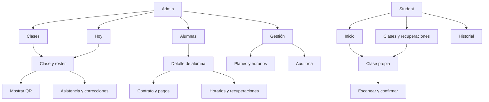

> Actualización Etapa 7.1: este documento conserva el diseño e inspección de F0. Para disponibilidad actual de endpoints y brechas, prevalecen [backend-contract-map](backend-contract-map.md) y el [contrato de integración](../frontend-integration-contract.md). No se inició Frontend F1.

# Arquitectura de información y propuesta frontend

Todas las rutas y features son propuestas, no archivos ni router implementados. Véanse [inventario](screen-inventory.md), [flujos Admin](admin-flows.md), [flujos Student](student-flows.md).

## Navegación — F0.2, F0.17, F0.25

| Experiencia | Destino principal | Contenido y decisión |
| --- | --- | --- |
| Admin | Hoy | Operación inmediata de las clases del día y búsqueda de alumna. |
| Admin | Alumnas | Buscar, crear y abrir el hub contractual y operativo de una alumna. |
| Admin | Clases | Lista por fecha, detalle/roster, QR, generación y operaciones de clase. |
| Admin | Gestión | Planes, horarios recurrentes, consultas globales de contratos/pagos y auditoría. |
| Student | Inicio | Próxima clase o clase abierta, restantes y acción contextual. |
| Student | Clases | Próximas clases y recuperaciones autorizadas, con detalle propio. |
| Student | Historial | Resultados anteriores propios; lectura pendiente API-03. |

La elección de cuatro destinos Admin responde a frecuencia y contexto: Hoy resuelve ahora; Clases permite buscar otra fecha. Subscription vive principalmente en la alumna. Su consulta global es secundaria para búsqueda operativa por filtros disponibles, enlazando al mismo detalle contractual, sin duplicar edición ni sumar una pestaña primaria. Audit queda dentro de Gestión y en enlaces contextuales.

Student no ve módulos Planes/Pagos/Suscripciones/Audit. Recuperaciones integra Clases y avisos contextuales de Inicio. Historial pertenece a la IA objetivo y es MUST HAVE condicionado por API; no se liberará una pestaña que presente datos parciales como historial completo. No sustituir la lectura faltante con datos locales.

Desktop Admin: sidebar de cuatro destinos y acceso a cuenta al pie. Mobile: barra inferior con los mismos cuatro rótulos; Gestión abre su lista secundaria. Student: barra inferior de tres destinos; en pantalla ancha, navegación compacta superior manteniendo el orden. Login, activación y scanner usan contextos concentrados; scanner conserva Volver/Salir visible. Cerrar sesión está en cuenta, disponible en ambos tamaños.

## Jerarquía conceptual

## URLs estables — F0.40

Nombres ingleses alineados con recursos del dominio; etiquetas visibles en español. Los IDs resuelven recursos, no permisos. Cada deep link vuelve a verificar sesión, rol y propiedad. Un 404 no confirma la existencia de recursos ajenos.

| Ruta propuesta | Contexto |
| --- | --- |
| `/admin/login` | Email y contraseña Admin. |
| `/activate` | Recepción inicial de fragmento secreto; limpieza inmediata. |
| `/access-required` | Student sin sesión/acceso utilizable. |
| `/admin` | Hoy. |
| `/admin/students`, `/admin/students/new`, `/admin/students/:id` | Lista, alta y hub. |
| `/admin/students/:studentId/subscriptions/new` | Contrato con alumna preseleccionada. |
| `/admin/subscriptions`, `/admin/subscriptions/:id` | Consulta global secundaria y detalle canónico con retorno a alumna. |
| `/admin/subscriptions/:subscriptionId/payments/new` | Alta de pago contextual. |
| `/admin/payments`, `/admin/payments/:id` | Consulta secundaria y detalle/anulación. |
| `/admin/classes`, `/admin/classes/:id`, `/admin/classes/:id/qr` | Agenda por lista, roster y QR. |
| `/admin/classes/generate` | Generación explícita por rango para todos los horarios activos. |
| `/admin/plans`, `/admin/plans/new`, `/admin/plans/:id` | Catálogo y formulario. |
| `/admin/schedules`, `/admin/schedules/new`, `/admin/schedules/:id` | Recurrencias y formulario. |
| `/admin/recoveries/:id` | Detalle contextual, accesible desde alumna/ausencia/destino. |
| `/admin/manage`, `/admin/audit` | Gestión secundaria y auditoría. |
| `/student`, `/student/classes`, `/student/classes/:id` | Inicio, próximas y clase propia. |
| `/student/classes/:id/scan`, `/student/classes/:id/confirmation` | Scanner y lectura del resultado; refrescar no repite POST. |
| `/student/recoveries/:id` | Recuperación propia, dentro del contexto Clases. |
| `/student/history` | Objetivo condicionado por lectura API-03. |

Crear/editar Enrollment, autorizar Recovery, corregir Attendance y confirmar anulaciones son formularios contextuales; no necesitan cada uno un destino principal. En mobile pueden ocupar el área de contenido completa, conservando contexto y retorno.

Filtros compartibles: fecha, estado y página; búsqueda nominal y borradores quedan en memoria por privacidad. Nunca challenge, credenciales, motivos o datos financieros en query params. El fragmento de activación se elimina antes de telemetría o navegación. Return-to admite sólo rutas internas compatibles con el rol, sin URL externa ni secreto. UUID en ruta no autoriza incluir la URL completa en analytics.

## Feature map — F0.41

| Feature | Responsabilidad conceptual |
| --- | --- |
| auth | Identidad, login, activación, guardas de navegación y cierre de sesión. |
| students | Listado, alta, actividad, acceso y composición del hub Admin. |
| plans | Catálogo y precio de referencia. |
| subscriptions | Contrato por período, resumen financiero y de clases. |
| payments | Registro, detalle, anulación e intención idempotente. |
| schedules | Recurrencias; Enrollment contextual para asignación/cambio/finalización. |
| class-sessions | Clases concretas, generación, capacidad y horario de ocurrencia. |
| attendance | Roster, ventana, QR, scanner, resultado, alta manual y correcciones. |
| recoveries | Autorización/cancelación Admin y consulta contextual por rol. |
| audit | Filtros y presentación de eventos públicos, sólo Admin. |
| student-home | Composición de consultas propias y decisión de acción actual. |
| shared | Shell, transporte seguro, formato de dinero/fecha, estados y primitivas visuales. |

No crear un store por entidad ni un directorio global de páginas/componentes que concentre todo. Cada feature expone entradas pequeñas; attendance no reimplementa las reglas de cupo ni pagos decide elegibilidad. Compartir presentación no implica compartir permisos Admin/Student. No se eligen versiones ni se instalan dependencias aquí.

## Server state y client state — F0.42

Propuesta: TanStack Query para respuestas y ciclo de actualización del servidor; estado local para formularios, scanner y navegación. Pinia sólo si preferencias/UI compartidas lo justifican. La API no se duplica en Pinia. Caché no persistente y claves con identidad/rol/recurso/filtros; limpiar al logout, cambio de identidad o pérdida de sesión, sin reutilizar respuestas Admin para Student.

Challenge y token de activación permanecen en memoria mínima de su flujo, fuera de caché persistida, logs, devtools de producción y analytics. Detener cámara y descartar frames/challenge al salir o perder sesión. No guardar respuestas personales, motivos ni borradores financieros en localStorage para ofrecer offline.

| Cambio confirmado | Lecturas a actualizar |
| --- | --- |
| Pago/VOID | Pagos del contrato y resumen financiero; detalle mostrado. |
| Contrato/cancelación | Contratos de alumna, resúmenes, inscripciones y clases/recuperaciones afectadas visibles. |
| Enrollment/horario/clase | Listado/detalle de clases y roster afectados; próximas y Recovery visibles. |
| Attendance/manual/corrección | Attendance de clase, resumen de consumo, historial de correcciones, Recovery afectada y auditoría consultada. Historial Student sólo cuando exista su contrato de lectura. |
| Autorizar/cancelar Recovery | Recuperaciones de alumna/origen, roster destino y próximas propias. |
| Actividad/acceso | Alumna y sesión según efecto backend; no reescribir resultados históricos localmente. |

No optimistic success para pagos, Attendance, Recovery o Correction. Optimismo sólo para interacción local reversible, como expandir sección. Las lecturas pueden conservar datos previos con aviso “Actualizando”; las mutaciones no se reintentan automáticamente. Payment tiene retry explícito de la misma intención y clave; el resto requiere conocer resultado antes de una nueva acción. Refrescar resumen fallido no repite la mutación.

Cambios de foco o conexión pueden refrescar lecturas relevantes sin interrumpir formulario/cámara. QR renueva sólo mientras su pantalla está activa y la ventana sigue abierta; no un polling global. Frecuencias y librería scanner se elegirán y validarán en implementación contra límites reales.
